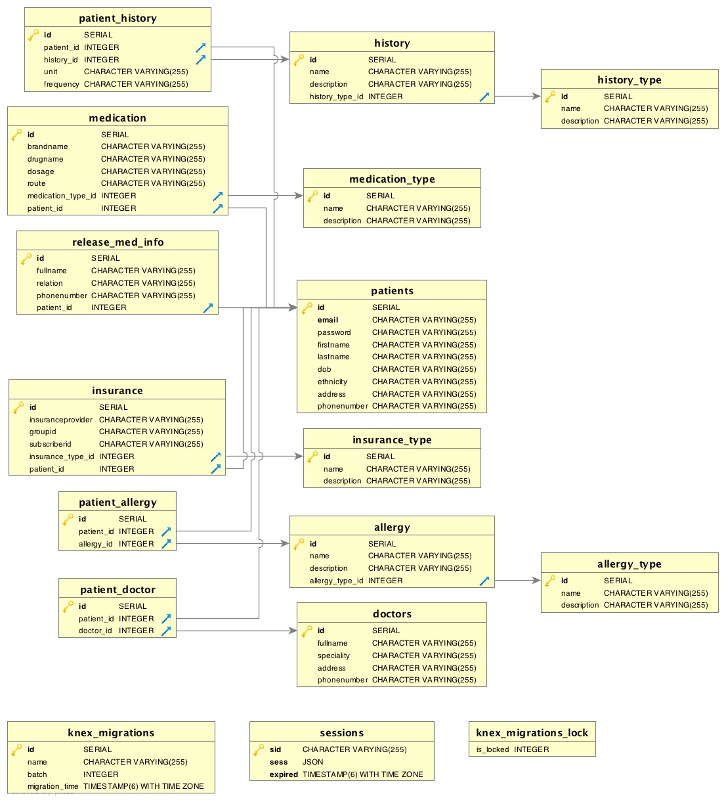

# patient-portal

Patient portal is a web app, which is a medical home on the web.
Patient-portal-ui app is here:- https://github.com/priyakamesh/patient-portal-ui
Feature:- Patient Portal app has  all the patient information.
Different modules in Patient Portal are:-
Login : Custom login
Registration :
Facility info (Primary physician details)
Personal info (Account info,Demographic, Insurance, Proxy)
Medical History (Social History, Family History, Allergy,Past allergy)
Medications (Current Medication and discontinued Medication)
Visit Summary (this is the place where Doctor/ Clinic will do push request.)

Link to Trello: https://trello.com/b/wjLmdaZA/patient-portal

Link to Moqup: https://app.moqups.com/krishnapriyakamesh@gmail.com/tBBiieWyLY/view/page/abafec954

